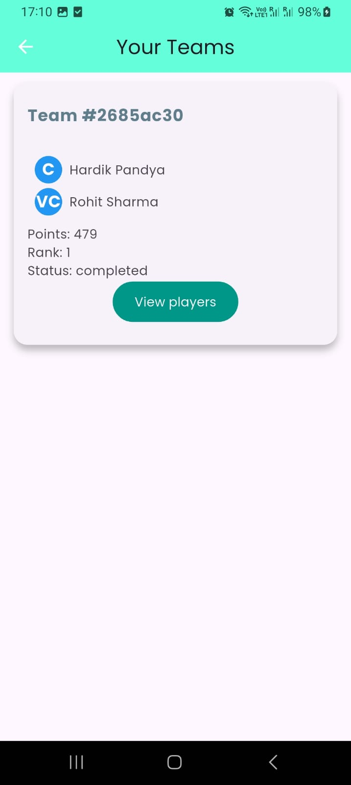
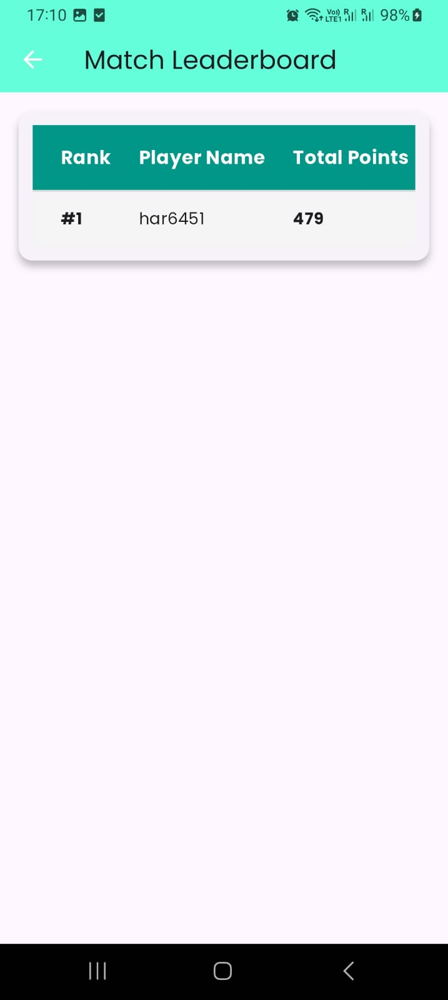
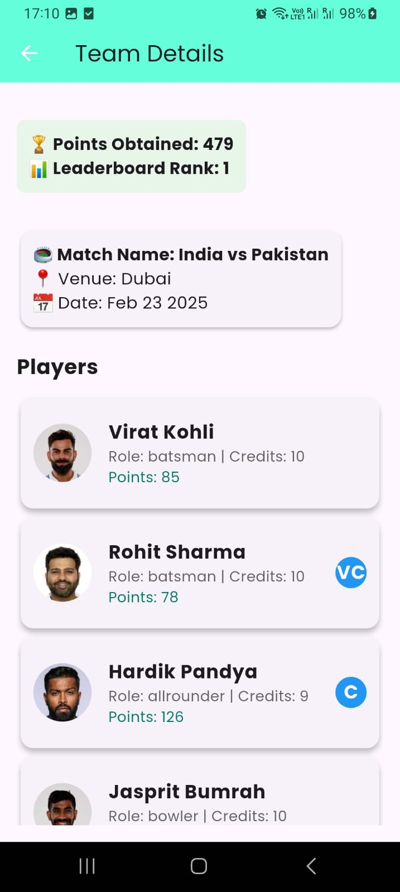

# Yorker

An MVP for a cricket fantasy app, made to understand how fantasy cricket apps could have been made, scaled, and used. This app is made using Flutter, and the backend is in TypeScript + Node.js, Express with Redis for caching, and RabbitMQ for offloading async tasks. The database used for this app is Postgres, and the ORM is Sequelize.

Just a try effort, adding more features and improving it :)

You can use the Android App at: [Download APK](https://drive.google.com/file/d/18ThPfU96DCsunslg69O-iNO2-D6xAsFI/view?usp=sharing)

## Video of the project

[Watch the video](https://youtube.com/shorts/Qf9ECKKZ1RE)

# Screenshots of the project

